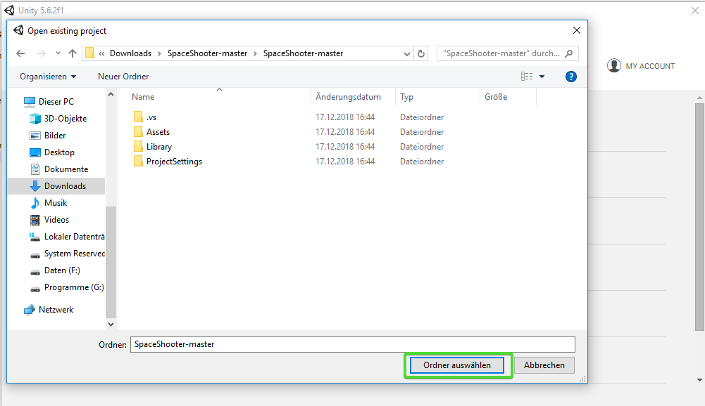

# Space-Asteroids

!!!abstract "Lernziele"
	In diesem Kapitel wirst du mithilfe des Gelernten aus den vorigen Kapiteln die letzten Teile des Spiels Space-Asteroids selber programmieren.

In Space-Asteroids fliegst du mit einem Raumschiff durch ein Asteroidenfeld. Du musst die Asteroiden abschießen oder ihnen ausweichen. Wenn du von einem getroffen wirst, explodiert das Raumschiff.


----

!!!success "Arbeitsauftrag"
	Vervollständige das Unity-Projekt. Lediglich die Programmierung der Asteroiden fehlt noch.


## Projekt downloaden

1. Gehe auf [https://github.com/learn2proGrAME/SpaceShooter](https://github.com/learn2proGrAME/proGrAME-Beispiele-und-Quellcodes/blob/master/SpaceAsteroids/SpaceAsteroids1.zip)

2. Klicke zuerst auf **"Clone or Download"** und dann auf **"Download ZIP"**

	

3. Nach dem Download entzippe das heruntergeladene Verzeichnis, öffne **Unity** und klicke auf **"Open"**

	

4. Gehe in das entpackte Verzeichnis und öffne das Projekt.

	

## Teste das Spiel

Klicke auf den Play-Button in Unity und teste das Spiel


Du kannst mit den Pfeiltasten herumfliegen und mit der Leertaste schießen.  
Ansonsten ist das Spiel aber noch recht langweilig.


Wenn du während das Spiel läuft in die Scene-View schaust, siehst du, dass am oberen Spielfeldrand schon Asteroiden erzeugt werden. Allerdings tun diese noch nichts.

----

## Bewegung der Asteroiden

### Die benötigten Variablen deklarieren

Als erstes kümmern wir uns darum, dass die Asteroiden in Bewegung gesetzt werden. Sie sollen senkrecht vom oberen Rand des Spielfelds zum unteren Rand fliegen.

Öffne unter *Assets/Scripts* das Script **Asteroid**  

Da wir die eingebaute Physic-Engine von Unity verwenden, benötigen wir für die Bewegung einen **Rigidbody**.

Erstelle als erstes eine *private* Variable vom Typ *Rigidbody* in der dieser gespeichert wird.

```csharp
	private Rigidbody rb;
```

Lege außerdem noch eine *public* Variable für die Geschwindigkeit an mit der der Asteroid fliegen soll.

```csharp
	public float geschwindigkeit;
```

### Bewegung im Spiel

Bevor du den Asteroiden in Bewegung setzen kannst, musst du die Variable des Rigidbodys initialisieren.  

Mache dies in der `start()` Methode mit dem Befehl `GetComponent<Rigidbody>()`

Dein Code sollte so aussehen:

```csharp
	 //Start() wird von Unity aufgerufen, wenn das Object erzeugt wird.
    void Start(){
        //Setze die Referenz auf den Rigidbody
        rb = GetComponent<Rigidbody> ();
	}
```

Nun müssen wir dem Rigidbody nur noch eine Geschwindigkeit geben.  
Verwende hierfür den Befehl `rb.velocity = new Vector3 (0, 0, -geschwindigkeit);`

Füge diesen Befehl ebenfalls in der `Start()` Methode nach dem Initialisieren von `rb` ein.

!!!tip "Hinweis"
	Vielleicht ist dir aufgefallen, dass wir die Variable geschwindigkeit noch gar nicht initialisiert haben. Das ist kein Problem. Da diese *public* ist, kann man ihren Wert im Inspector von Unity festlegen.

Speichere das Script und gehe wieder in Unity.

Im Ordner *Assets/Vorlagen* findest du die Vorlage für die Asteroiden. Wenn du sie auswählst siehst du, dass das Script *Asteroid.cs* bereits angehängt ist. Wenn du nun noch die geschwindigkeit auf einen Wert größer als 0 setzt, bist du mit diesem Teil fertig.


Vergiss nicht zu testen und probiere ein paar unterschiedliche Werte für die Geschwindigkeit aus!

----

## Rotation der Asteroiden

Die Asteroiden bewegen sich nun zwar, allerdings sehen sie noch ein bisschen leblos aus. Lassen wir sie rotieren!

Sie sollen mit einer bestimmten Geschwindigkeit um eine zufällige Achse rotieren.

Erstelle eine *public* Variable vom Typ *float* für die Rotationsgeschwindigkeit und gib ihr einen sinnvollen Namen.

Dann füge am Ende der Methode `start()` folgenden Befehl ein:

```csharp
	rb.angularVelocity = Random.insideUnitSphere * rotationsgeschwindigkeit;
```

Wobei `rotationsGeschwindigkeit` der von dir gewählte Variablenname sein muss.

Speichere das Skript, gehe in Unity und setze die Rotationsgeschwindigkeit im Inspector so wie in Schritt 3.2.

Teste!

----

## Kollision

Die Asteroiden fliegen herum, drehen sich und wenn sie das Raumschiff berühren wird dieses zerstört. Allerdings kann man sie noch nicht abschießen.

In diesem Teil wirst du folgende Dinge programmieren:

Wenn ein Asteroid mit einem Lasergeschoß kollidiert ...

1. ... werden Lasergeschoß  und der Asteroid gelöscht
2. ... wird der Punktestand erhöht
3. ... wird ein Sound abgespielt

!!!Tip "Hinweis"
	Der meiste Code in diesem Teil wird in der Methode ``` OnTriggerEnter(Collider other) ``` eingefügt. Diese Methode wird (etwas vereinfacht gesagt) von Unity immer dann aufgerufen, wenn eine Kollision stattfindet.
	Der Parameter `other` ist hierbei der Collider des GameObjects mit dem kollidiert wird.

### Was kollidiert?

Bevor wir implementieren, was geschehen soll, müssen wir überprüfen womit der Asteroid überhaupt kollidiert.

Füge ein *if-Statement* in der Methode `OnTriggerEnter()` ein, das überprüft ob die Variable `other.tag` gleich "Geschoß" ist. Um zu überprüfen ob `other` ein Lasergeschoß ist.

!!!tip "Hinweis"
	Man kann in Unity jedem Gameobject und jeder Vorlage einen **tag** zuweisen. Dieser **tag** ist als *String* Variable `tag` in jedem GameObject verfügbar. In diesem Spiel wurde z.B. den Lasergeschoßen der **tag** "Geschoß" und den Asteroiden der **tag** "Hindernis" gegeben.

### Geschoß und Asteroid löschen

Um in Unity ein Gameobject zu löschen verwendet man die Funktion `Destroy(GameObject)`. Diese löscht das Gameobjekt, das als Parameter angegeben wird am Ende des aktuellen Spielframes.

Rufe nun zweimal die Funktion `Destroy()` auf. Gib einmal `other.gameObject` und einmal `gameObject` als Parameter an.

### Punktestand erhöhen

Der GameController stellt die Methode `ErhoehePunktestand(int punkte)` zur Verfügung.

Bevor du diese Funktion aufrufen kannst, benötigst du allerdings eine Variable mit einer Referenz auf den GameController.

1. Erstelle eine *private* Variable vom Typ *GameController* am Beginn der Klasse und nenne sie "gameController".
2. Initialisiere in der Methode `Start()` die Variable für den GameController mithilfe der Funktion ``` FindeGameController() ```

```csharp
	gameController = FindeGameController();
```


Rufe nun in der Methode `OnTriggerEnter()` im Asteroid-Skript die Funktion `ErhoehePunktestand(int punkte)` des GameControllers auf und gib als Parameter z.B. *10* an.

!!!tip "Hinweis"
	Um eine Funktion in einem anderen Objekt aufzurufen, verwende: *variablenname-des-objekts.FunktionsName()*
	Also z.B. ``` gameController.ErhoehePunktestand(10); ```

### Sound abspielen

Lege als erstes eine *public* Variable vom Typ *AudioClip* am Beginn der Klasse an und speichere das Skript.

Gehe in Unity auf *Assets/Vorlagen* und wähle *Asteroid* aus. Im Inspektor siehst du die Variable für den AudioClip.

Klicke auf die Zielscheibe rechts daneben und wähle "Explosion1" aus.


Zum Abspielen des Sounds gibt es im GameController die Methode ```csharp SpieleSound(AudioClip sound, float lautstaerke) ```

Rufe diese Methode innerhalb von `OnTriggerEnter` auf und gib als Parameter die Variable für den Sound und `0.2f` an.

----

## Vollständiger SourceCode

Dein fertiger Sourcecode sollte in etwa so aussehen:

```csharp
	using System.Collections;
	using System.Collections.Generic;
	using UnityEngine;

	public class Asteroid : MonoBehaviour {

		//Referenz auf den Rigidbody
		private Rigidbody rb;

	    //Die Geschwindigkeit mit der die Asteroiden fliegen
	    public float geschwindigkeit;

	    //Rotationsgeschwindigkeit
	    public float rotationsGeschwindigkeit;

		//Referenz auf den GameController
		private GameController gameController;

	    //Der Sound der bei der Zerstörung eines Asteroiden abgespielt wird.
		public AudioClip explosionsSound;


	    //Start() wird von Unity aufgerufen, wenn das Object erzeugt wird.
	    void Start(){

	        //Setze die Referenz auf den Rigidbody
	        rb = GetComponent<Rigidbody> ();

	        //Setze die Geschwindigkeit
	        rb.velocity = new Vector3 (0, 0, -geschwindigkeit);

			//Setze die Rotationsgeschwindigkeit
	        rb.angularVelocity = Random.insideUnitSphere * rotationsGeschwindigkeit;

			//Setze GameController-Referenz
			gameController = FindeGameController();
	    }

	    //OnTriggerEnter() wird von Unity aufgerufen, wenn ein anderer Collider mit dem eigenen Collider kollidiert.
	    void OnTriggerEnter(Collider other)
	    {
	        //Überprüfe ob das andere Objekt ein Geschoß ist.
	        if (other.tag == "Geschoß")
	        {
	            //Lösche das Geschoß
	            Destroy(other.gameObject);

				//Lösche den Asteroiden selbst
				Destroy(gameObject);

				//erhöhe den Punktestand
				gameController.ErhoehePunktestand(10);

				//Spiele den explosionsSound ab
	            gameController.SpieleSound(explosionsSound, 0.2f);
	        }
	    }

		// Diese Methode sucht nach dem GameController
		// Wenn einer gefunden wird, wird eine Referenz darauf zurückgegeben.
		// Wenn kein GameController vorhanden ist, wird das Spiel mit einer Fehlermeldung beendet.
		private GameController FindeGameController() {

			GameObject gameControllerObject = GameObject.FindWithTag("GameController");

			//Befindet sich kein GameController im Spiel ist gameControllerObject == null
			if (gameControllerObject != null)
			{
				return gameControllerObject.GetComponent<GameController>();
			}
			else
			{
				Debug.LogError("Cannot find GameController Script");
				Application.Quit();
				return null;
			}
		}
	}
```
