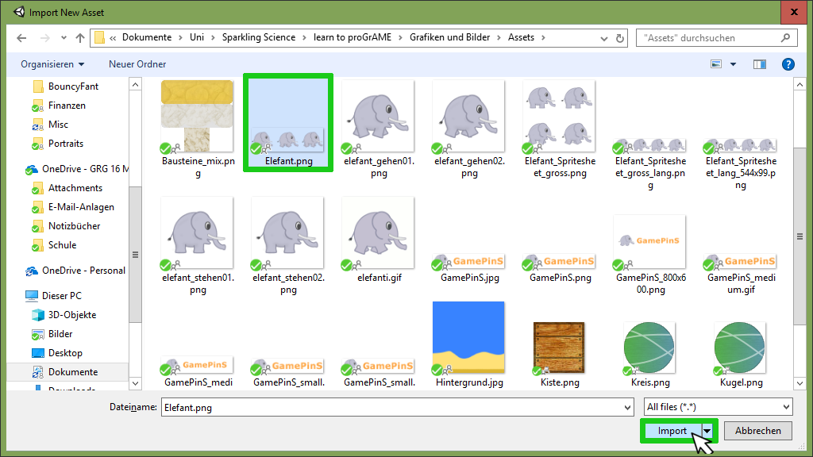

# Teil 1 - Neues Projekt erstellen und Assets einfügen

In diesem Kapitel wirst du...   |  Erledigt?
------------------------------- | -----------
Den Arbeitsbereich kennenlernen.|  
Ordner im Asset-Bereich hinzufügen.|  
Neue Assets zu deinem Projekt hinzufügen. |
Einen komplexen Sprite zerteilen. |  
Einen Sprite zu deinem Spiel hinzufügen. |   

Wenn du Unity startest, erscheint zuerst ein Startfenster. Klicke dort auf “NEW”.
Im späteren Verlauf des Projekts, kannst du einfach auf dein Projekt in der Liste klicken, oder es über die “OPEN” öffnen.

Gib bei den erweiterten Einstellungen einen sinnvollen Namen (z.B. <DeinName>_BouncyFant) ein. Ganz wichtig ist es, beim Projekttyp “2D” auszuwählen. 

!!!bug "Achtung!"  
    Es kann sein, dass an deiner Schule Netzwerklaufwerke verwendet werden und du dein Projekt deswegen unter einem bestimmten Laufwerk (bzw. Pfad) abspeichern musst, damit du es später nicht verlierst. Frag am besten deine Lehrperson deswegen. 
 
Sobald du den Speicherpfad, den Namen und „2D“ ausgewählt hast, kannst du bereits auf “Create project” klicken. 

## Arbeitsbereich kennenlernen und konfigurieren

Dieser Abschnitt wiederholt denjenigen aus dem [Grundlagentutorial](/0120-userinterface/0120-userinterface).

In Unity gibt es 3 wichtige Bereiche, die wir über den Verlauf des Tutorials sehr oft verwenden werden. Wir empfehlen dir, dass du dir ein paar Minuten nimmst und dich mit ihnen vertraut machst.

### Hierarchy Panel (G)
Das Hierarchy Panel ist sozusagen eine Übersicht über alle Game Objects (G) die wir zu unserem Spiel hinzugefügt haben. Es ist eine Hierarchie, weil wir manchmal mehrere Game Objects zusammenpacken wollen. Eine Plattform auf der deine Figur springt könnte zum Beispiel aus mehrere Teilen bestehen, die wir dann auch zusammenpacken wollen.

### Inspector Panel (G)
Im Inspector Panel können wir die Game Objects, die wir unserem Spiel hinzugefügt haben genauer inspizieren, daher auch der Name. Dort kannst du sogenannte Komponenten des ausgewählten Game Objects hinzufügen, entfernen und konfigurieren. Diese Komponenten erlauben uns coole Dinge wie zum Beispiel, eine Figur zu steuern, sie zu animieren, sie von Dingen abprallen zu lassen und viele weitere Dinge.

!!!bug "Achtung!"  
    Je nachdem, was du markiert hast, sind die Dinge, die im Inspector Panel angezeigt werden, andere. Wenn du etwas nicht findest, schau zuerst ob du auch die richtige Sache markiert hast.

### Asset-Bereich (G)
Der Asset-Bereich ist unsere Sammlung aller Assets, also Dateien wie zum Beispiel Scripte, Bilder oder Musik, die wir in unser Projekt einbauen möchten. Wir müssen neue Assets immer zuerst in unser Projekt importieren, damit wir sie verwenden können, außer wir haben sie in Unity selbst erstellt. 

Du kannst das Aussehen des Asset-Bereichs ändern, indem man rechts unten die Zoomleiste bewegt (siehe Screenshot). Alternativ funktioniert auch STRG + Mausrad.

## Neue Ordner und Assets hinzufügen
Bevor wir in Unity unsere Ordnerstruktur anlegen, laden wir uns einmal ein paar Assets (G) aus dem Internet herunter und speichern diese in den entsprechenden Objektordner. Die Assets, mit denen wir arbeiten werden, finden wir an folgenden Orten:

 - www.comber.at/dev/assets.zip
 - https://www.gameart2d.com/free-platformer-game-tileset.html 

Die Zip-Datei, die du heruntergeladen hast, musst du natürlich zuerst entpacken. Das kannst du mit Rechtsklick auf die Datei im Windows Explorer und dann einem Klick auf “Alles extrahieren” machen. 
Pass aber auf, wohin du die Dateien entpackst, damit du sie auch wieder findest.

In Unity fügen wir zuerst neue Ordner hinzu. Für Dein Projekt brauchst du folgende Ordner: 

- Material (für die Materialeigenschaften für die Physiksimulation)
- Scripts (für die zu programmierenden Scripte)
- Sprites (für die Grafiken)
- Vorlagen (für Spielobjekte, die wir als Vorlagen erstellen und verwenden)

Neue Ordner legt man mit Rechtsklick in das Asset Panel und dann durch einen Klick auf *Create -> Folder* an.

Um ein Asset zu unserem Spiel hinzuzufügen, müssen wir im Asset Panel rechtsklicken und dann *Import New Asset* auswählen.

Im nachfolgenden Fenster navigieren wir zu dem Ordner, in dem wir unsere heruntergeladenen Spielegrafiken gespeichert haben, wählen unsere Spielfigur aus und klicken auf Import. (Mehr zum Erstellen einer von dir erstellten Spielgrafik findest du in unserem GIMP-Tutorial auf Moodle oder auf unserem Youtube-Channel:

!!!bug "Achtung!"  
    Platziere deine ganzen Assets von Anfang an in den Ordner wo sie auch am Ende drin liegen sollen und gib ihnen einen eindeutigen Namen den du nicht mehr ändern musst.
Unity merkt sich immer den Pfad und Namen deines Asset im Projektordner, und nicht das Asset als Bild an sich. Wenn du die Dateien später verschiebst oder umbenennst und sich dadurch der Pfad ändert, kann es sein, dass dein Level nicht mehr funktioniert. Lege also den Elefanten also jetzt schon in den Ordner wo du ihn auch am Ende willst, also zum Beispiel den “Sprites” Ordner mit einem eindeutigen Namen wie “Elefant.png” ab.

## Das Sprite zerschneiden
Wie du vielleicht schon gesehen hast, besteht unsere Elefantengrafik aus drei sehr ähnlichen Bildern. Wir nennen diese Bilder die Animationsstufen. Damit wir später die Animation (Beine, Rüssel und Schwanz bewegen sich beim Gehen) für den Elefanten erstellen können, müssen wir jetzt die einzelnen Animationsstufen des Elefanten aus dem Spritesheet(G) (also unsere Elefantengrafik) extrahieren. Man kann sich das so vorstellen, als ob man das Spritesheet zerschneiden würde. Bevor wir jedoch mit dem Zerschneiden des Spritesheets anfangen können, müssen wir noch den *Sprite Mode* von *Single* auf *Multiple* ändern. Damit teilen wir Unity mit, dass in unserem importierten Bild mehrere Animationsstufen eines Sprites vorhanden sind. 

Das Zerschneiden bewerkstelligen wir, indem wir den Elefanten-Sprite im Asset Panel markieren, und dann im Inspector Panel den *Sprite Editor* öffnen.

Falls wir hier gefragt werden, ob wir die Änderungen annehmen wollen, klicken wir auf *Apply*.

### Manuell zerschneiden
Im Sprite Editor klicken wir nun auf *Slice*, um unser Spritesheet zu zerteilen. Nun gibt es mehrere Möglichkeiten ein Sprite zu zerteilen. Wenn man die Animationsstufen nebeneinander genau positioniert hat, dann ist es sinnvoll das Sprite manuell zuzuschneiden. Dazu wähle den Modus *Grid By Cell Count*. In diesem Modus wird das Sprite wie in einer Tabelle in Zeilen (R steht für Rows) und Spalten (C steht für Columns) aufgeteilt. Wir haben 3 Elefanten in einer Zeile. Wenn wir uns das jetzt als Tabelle vorstellen ist klar, wir haben 1 Zeile und 3 Spalten, das heißt wir schreiben bei R 1 und bei C 3. Zum Zerteilen bestätigen wir das Ganze mit *Slice*.

Eine andere Möglichkeit ist, das Sprite automatisch zerteilen zu lassen. Dazu wählen wir als *Type Automatic* aus und dann bestätigen wir das ganze mit Slice. Das geht aber nicht immer, je nachdem welches Asset du verwendest.

Falls du dein eigenes Sprite verwendest, musst du die Einstellungen vielleicht anpassen. Es kann auch sein, dass das Ergebnis beim “Slicen” (=zerschneiden) nicht ganz perfekt ist. Du kannst dann auf die Animationsstufe klicken und sie mit den Blauen kreisen zurechtziehen.

Nach dem Slicen geben wir den einzelnen Animationsstufen im Sprite Editor noch sinnvolle Namen. Hierfür klicken wir auf die jeweilige Animationstufe und geben den jeweiligen Namen ein, siehe Screenshot. (In unserem Fall Elefant_Stehen, Elefant_Gehen_1, Elefant_Gehen_2)

!!!bug "Achtung!"
    Bevor du den Sprite Editor schließt, musst du deine Änderungen mit “Apply” bestätigen und speichern.

!!!bug "Achtung!"  
    Platziere deine ganzen Assets von Anfang an in den Ordner wo sie auch am Ende drin liegen sollen und gib ihnen einen eindeutigen Namen den du nicht mehr ändern musst.

### Die Spielfigur zur Spielszene hinzufügen

Unser Ziel ist es jetzt, einen stehenden Elefant als GameObject dem Spiel hinzuzufügen. Dazu klappen wir zuerst das Sprite Elefant auf (klicke auf den kleinen Pfeil links neben Elefant im Asset Panel, im Ordner *Sprites*). Dann siehst du die einzelnen Animationsstufen (Elefant_Gehen_1, Elefant_Gehen_2, Elefant_Stehen). Durch Ziehen der Animationsstufe *Elefant_Gehen* vom Asset Panel in das Hierarchy Panel fügen wir den Elefanten zum Spiel hinzu. Dabei wird auch gleich ein neues GameObject erstellt.

Ist der Elefant hinzugefügt, passen wir noch die Größe an. Das können wir bewerkstelligen, indem wir das Sprite des Elefanten anklicken und im Inspector Panel bei *Pixels Per Unit* den Wert anpassen (in unserem Fall beispielsweise 300). Mit Apply wird das Ganze wieder bestätigt.

### Speichern der Spieleszene

Die Spielszene müssen wir zusätzlich zum Projekt speichern. Du kannst dir jede Spieleszene wie ein Level vorstellen. Wir bleiben aber vorerst bei einem Level. Die Spieleszene speichert man durch einen Klick auf *File->Save Scene* oder mit der Tastenkombination STRG + S. Das gesamte Projekt musst du darauf noch mit *File->Save* Project speichern!

Mit “Play” können wir das Spiel starten. Momentan tut sich noch nicht viel, da der Elefant sich noch nicht bewegt und auch Grafiken für den Hintergrund und für die anderen Objekte im Spiel müssen erst hinzugefügt werden. Wir können jedoch das Seitenverhältnis einstellen: Wir wählen bei BouncyFant das Verhältnis 4:3, da in dem Spiel viel gesprungen wird und wir deswegen mehr Platz nach oben, als zur Seite wollen.

#### Sourcecode	
Download Sourcecode Teil 01: http://comber.at/dev/BouncyFant01.zip

