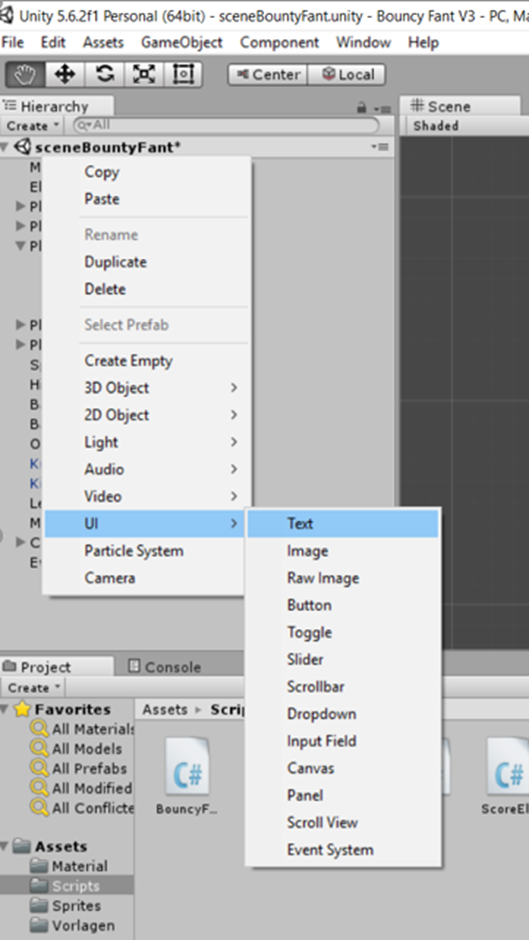

# Teil 8 - Play to compete, cooperate to win!

!!! Abstract "Ziele"
    Im ersten Level ist es das Ziel, einen magischen Pilz zu erreichen. Diejenige, die zuerst den Pilz erreicht, bekommt einen Punkt. Das erste Level ist geschafft, wenn einer der Elefanten 10 Punkte erreicht hat. Die Zusammenarbeit kann aber über das bloße, gemeinsame Sammeln von Punkten auch hinausgehen. Beispielsweise könnt ihr euch helfen, den Pilz zu erreichen, etwa indem ihr euch gegenseitig in die Luft katapultiert und so höhere Sprünge machen könnt.

---

In diesem Kapitel wirst du... | Erledigt?
----------------------------- | ---------
Ein Zielobjekt (den Zauberpilz) erstellen. |
Ein Punktezähler als Text hinzufügen, der die Siege eines Spielers aufzeichnet. |
Eine Funktion schreiben die dein Level neu lädt. |
Eine Funktion schreiben, die den Punktezähler erhöht wenn man den Pilz mit der Figur berührt. |


## Der Zauberpilz und seine Eigenschaften

Lassen wir einen magischen Pilz entstehen, der, wenn er berührt wird, einen Punkt für den jeweiligen Bouncy Fant bringt!

Zum Einstieg beginnen wir gleich mit einer Aufgabe, deren Lösungsweg wir schon aus den vorigen Kapiteln kennen.

### Aufgabe 3
Füge dem Spiel auf der obersten Plattform die Grafik (*freetileset_jungle\png\Object\Mushroom_2.jpg*) des magischen Pilzes hinzu.

!!!Info "Hinweis"
    Das Tileset findest du in unserem Moodle Kurs oder bei Open Game Art. Wenn du die vorigen Übungen gemacht hast, dann hast du es bereits gespeichert.



#### Lösung
Mittels Rechtsklick in den *Assets-Bereich* und *Import Assets* wird der Pilz aus dem Pfad *freetileset_jungle\png\Object\Mushroom_2.jpg* importiert.


Mittels Drag & Drop ziehen wir dann den Pilz einfach an die gewünschte Position im Szenenbereich.


Der Pilz bekommt nun einen 2D-Polygon-Collider: Dazu klickt man in der Spieleszene auf den Pilz und wählt im Inspector *Add Component/Physics 2D/Polygon Collider 2D*.

### Score
Nun wollen wir den Text einbauen, der anzeigt, wie oft Elli bzw. Ossi gepunktet, also den Pilz erreicht haben. Glücklicherweise bietet Unity eine Funktion an, die es erlaubt Text auf einem sogenannten *User Interface* anzuzeigen.

Mittels Rechtsklick im *Hierachy* Bereich *UI>Text*  fügen wir eine Textanzeige hinzu.

{: style="height:40%;width:40%"}

Hierbei wird ein Objekt *Canvas* erzeugt mit einem ChildObjekt *Text*. Wir benötigen insgesamt drei Texte, je einmal die Punkte für Elli und Ossi, sowie einen Text der bei Spielende erscheinen soll.
Wir duplizieren also as Text-Objekt zweimal und benennen sieTextPunkteElli, TextPunkteOssi und TextGewinner.


Danach verändern wir noch die Position der Texte für die Punktestände.

{: style="height:35%;width:35%"} {: style="height:60%;width:60%"}

Je nach Bildschirmgröße, kann es sein, dass man die Position anpassen muss, sodass der Text nicht außerhalb des Bilds ist. Beachtet jedoch, dass Horizontal- und Vertical Overflow tatsächlich auf Overflow gesetzt sind. Ist nämlich Vertical Overflow  auf Truncate gesetzt, dann kann es passieren, dass euer Text ab einer gewissen Größe nicht mehr angezeigt wird.

!!!Info "Erklärung"
    Truncate bedeutet nämlich viel wie Abschneiden oder Wegschneiden. Die Größe des Textfeldes wird ja bei bei den Eigenschaften Rect Transform unter Width und Height angegeben. Ist nun der Text größer als die angegebene Höhe und Vertical Overflow auf Truncate gesetzt,  dann wird einfach der komplette Text weggeschnitten, da er über den Rand hinaus steht.

##Der Code für die Punkteanzeige und die Kollisionserkennung

Die benötigten Änderungen fügen wir im Script *BouncyFant.cs* hinzu.
Bei den using Klauseln kommt die Zeile *using UnityEngine.UI* hinzu. Dies ermöglicht es uns, das User Interface zu verwenden. Das Elternobjekt *BouncyFant* erhält noch die Variablen: *public int Punkte = 0;*, *public Text Infotext;* und *public Text Gewinnertext;*.


**BouncyFant.cs**
```C#
using System.Collections;
using System.Collections.Generic;
using UnityEngine;
using UnityEngine.UI;
using UnityEngine.SceneManagement;

public class BouncyFant : MonoBehaviour
{
    protected Rigidbody2D Elefantenkoerper;
    protected Animator Animation;
    public string Name;
    public float MaxGeschwindigkeit = 10;
    public float Sprungkraft = 300;
    protected int Punkte;
    public Text PunkteText;
    public Text GewinnerText;

    // Prozedur zum Bewegen des Elefanten
```

Diese Prozedur startet das Level neu.

**BouncyFant.cs**
```C#
    // Neuladen der Szene nach einer Wartezeit
    void NeuLaden()
    {
        SceneManager.LoadScene("sceneBouncyFant");
        Time.timeScale = 1.0f;
    }
```


Die Methode *void OnCollisionEnter2D(Collision2D col)* wird aufgerufen, wenn eine Kollision vorliegt. In *if (col.gameObject.name == "Pilz")* wird geprüft, ob der Elefant mit dem Pilz kollidiert und falls ja, dann werden die Punkte des Elefanten erhöht und ein Gewinntext ausgegeben.  
In der zweiten If-Anweisung wird geprüft, ob der Punktestand von 10 erreicht ist. Falls ja, werden die Punkte wieder zurückgesetzt.
Zum Schluss wird das Level mit einer Verzögerung von drei Sekunden neu gestartet.

**BouncyFant.cs**

```C#
    // Beim Berühren des Pilzes die Punkte erhöhen und einen Gewinntext ausgeben.
    void OnCollisionEnter2D(Collision2D col)
    {
        // Falls das Kollisionsobjekt der Pilz ist ...    
        if (col.gameObject.name == "Pilz")
        {
            Punkte++; // Erhöhen des Punktestands um 1
            // Punktestand dauerhaft speichern,
            // damit beim Neuladen der Szene der Punktestand nicht verloren geht
            PlayerPrefs.SetInt("Punkte" + Name, Punkte);
            // Name und Punkte anzeigen
            PunkteText.text = Name + " " + Punkte.ToString();
            GewinnerText.text = Name + "  W I N S !"; // Gewinnermeldung
            if (Punkte >= 10)
            {
                GewinnerText.text = "L E V E L   C O M P L E T E D"; // Geschafft
                // Rücksetzen des Punktestands für alle Elefanten auf 0
                Punkte = 0;
                PlayerPrefs.SetInt("PunkteElli", Punkte);
                PlayerPrefs.SetInt("PunkteOssi", Punkte);
            }
            // Zerstören des Pilzes
            Destroy(col.gameObject);
            // Planen des Neuladens der Szene nach 3 Sekunden Wartezeit
            Invoke("NeuLaden", 3);
        }
    }
```

!!!Tip "Kleine Wiederholung zur Vererbung"
    Da wir die Änderungen in der Elternklasse BouncyFant durchführen, brauchen wir dies nicht für jeden Elefanten (Elli, Ossi,...) einzeln zu tun.


Außerdem müssen wir die Prozedur *public virtual void Start()* einfügen, in der wir den Punktestand und den Punktetext setzen.

**BouncyFant.cs**
```C#
public virtual void Start(){
  // Laden des Punktestandes aus den Playerprefs und Anzeigen
  Punkte = PlayerPrefs.GetInt("Punkte" + Name);
  PunkteText.text = Name + " " + Punkte.ToString();
  GewinnerText.text = "";
}
```

!!!Info "Das Schlüsselwort *virtual*"
    Das Schlüsselwort *virtual* gibt an, dass diese Methode in den Child-Klassen überschrieben werden kann. Dies benötigen wir, da in *Elli.cs* und *Ossi.cs* *start()* schon definiert ist. Zu den überschreibenden Methoden in den Child-Klassen muss man dann das Schlüsselwort *override* angeben.


Der gesamte Quellcode von BouncyFant.cs sieht nun so aus:

**BouncyFant.cs**
```C#
using System.Collections;
using System.Collections.Generic;
using UnityEngine;
using UnityEngine.UI;
using UnityEngine.SceneManagement;

public class BouncyFant : MonoBehaviour
{
    protected Rigidbody2D Elefantenkoerper;
    protected Animator Animation;
    public string Name;
    public float MaxGeschwindigkeit = 10;
    public float Sprungkraft = 300;
    protected int Punkte;
    public Text PunkteText;
    public Text GewinnerText;

    public virtual void Start(){
      // Laden des Punktestandes aus den Playerprefs und Anzeigen
      Punkte = PlayerPrefs.GetInt("Punkte" + Name);
      PunkteText.text = Name + " " + Punkte.ToString();
      GewinnerText.text = "";
    }

    // Prozedur zum Bewegen des Elefanten
    protected void Gehen(float h)
    {
        /* Geschwindigkeit setzen
            * Die Geschwindigkeit ergibt sich aus aus der Eingabe für die horizontale
            * Geschwindigkeit und der maximalen Höchstgeschwindigkeit des Elefanten
            */
        Elefantenkoerper.velocity = new Vector2(h * MaxGeschwindigkeit, Elefantenkoerper.velocity.y);

        /* Blickrichtung des Elefanten bestimmen.
            * Der Vektor für die Blickrichtung soll ein Vektor sein,
            * der sich aus dem Vorzeichenrückgabewert (-1 oder +1)
            * der horizontalen Bewegungsrichtung (Mathf.Sign(h)) und
            * dem Skalierungsfaktor auf der x-Achse ergibt.
            * Der y-Wert des Elefanten bleibt gleich, daher nehmen wir nur den
            * Skalierungsfaktor "transform.localScale.y".       
            */
        if (h != 0)
            transform.localScale = new Vector2(Mathf.Sign(h) *
                Mathf.Abs(transform.localScale.x), transform.localScale.y);

        /* Die Geschwindigkeit wird auf den Absolutbetrag der horizontalen
            * Bewegung gesetzt. Negative Geschwindigkeit gibt es nicht.
            * z.B. wenn ich mit dem Auto im Rückwärtsgang 10km/h fahre, fahre ich
            * 10km/h in einer Rückwärtsbewegung und nicht "-10km/h" ;)
            */
        Animation.SetFloat("Geschwindigkeit", Mathf.Abs(h));
    }

    // Feststellen, ob der Elefant am Boden ist.
    protected bool AmBoden()
    {
        // Abfragen der Grenzen der Kollisionsobjekte
        Bounds Grenze = GetComponent<Collider2D>().bounds;
        float Spielraum = Grenze.size.y * 0.1f;

        /* Berechnen einer Position die ein wenig unter der Kante des
         * Kollisionsobjekts liegt sonst kann es vorkommen, dass der
         * Elefant nicht springen kann, wenn er ganz still steht.
         */
        Vector2 v = new Vector2(Grenze.center.x, Grenze.min.y - Spielraum);
        // Kollisionsabfrage:  mittels einer Linie  
        RaycastHit2D Kollision = Physics2D.Linecast(v, Grenze.center);

        // "true" zurückgeben, wenn das Kollisionsobjekt nicht der Elefant selbst ist.
        return (Kollision.collider.gameObject != gameObject);
    }

    // Springen
    protected void Springen(KeyCode Taste)
    {
        // Herausfinden, ob der Elefant irgendwo steht, von wo er abspringen kann
        bool springenmoeglich = AmBoden();

        /* Wenn der Pfeil nach oben gedrückt wird und Springen möglich,
         * d.h. der Elefant hat etwas, von wo er aus wegspringen kann,
         * dann bekommt der Elefantenkörper einen Impuls (Addforce),
         * entsprechend der von uns gewählten Sprungkraft
         */
        if (Input.GetKey(Taste) && springenmoeglich)
            Elefantenkoerper.AddForce(Vector2.up * Sprungkraft);

        /*
         * Wenn der Elefant gerade springt, dann springen auf nicht möglich setzen.
         * Nicht = Rufzeichen(!).
         */
        Animation.SetBool("Springen", !springenmoeglich);
    }

    // Neuladen der Szene nach einer Wartezeit
    void NeuLaden()
    {
        SceneManager.LoadScene("sceneBouncyFant");
        Time.timeScale = 1.0f;
    }

    // Beim Berühren des Pilzes die Punkte erhöhen und einen Gewinntext ausgeben.
    void OnCollisionEnter2D(Collision2D col)
    {
        // Falls das Kollisionsobjekt der Pilz ist ...    
        if (col.gameObject.name == "Pilz")
        {
            Punkte++; // Erhöhen des Punktestands um 1
            // Punktestand dauerhaft speichern,
            // damit beim Neuladen der Szene der Punktestand nicht verloren geht
            PlayerPrefs.SetInt("Punkte" + Name, Punkte);
            // Name und Punkte anzeigen
            PunkteText.text = Name + " " + Punkte.ToString();
            GewinnerText.text = Name + "  W I N S !"; // Gewinnermeldung
            if (Punkte >= 10)
            {
                GewinnerText.text = "L E V E L   C O M P L E T E D"; // Geschafft
                // Rücksetzen des Punktestands für alle Elefanten auf 0
                Punkte = 0;
                PlayerPrefs.SetInt("PunkteElli", Punkte);
                PlayerPrefs.SetInt("PunkteOssi", Punkte);
            }
            // Zerstören des Pilzes
            Destroy(col.gameObject);
            // Planen des Neuladens der Szene nach 3 Sekunden Wartezeit
            Invoke("NeuLaden", 3);
        }
    }
}
```

!!!Bug "Hinweis"
    Im Moment bekommen wir eine Fehlermeldung, wenn wir das Spiel starten wollen, da in *Elli.cs* und *Ossi.cs* eine virtuelle Methode überschrieben wird und das Schlüsselwort *override* fehlt.  

Gehe in das Skript *Elli.cs* und füge zur Prozedur *Start()* das Schlüsselwort *override* ein und rufe am Ende die Methode *Start()* der Parentklasse auf (verwende dafür den Befehl *base.Start()*)

!!!Info "Start() und Vererbung"
    Unity ruft bei der Erzeugung eines Objekts immer automatisch *Start()* auf. Allerdings nur direkt in der zugehörigen Klasse und nicht auch in allen Parent-Klassen. Das heißt, damit *Start()* aus *BouncyFant.cs* ausgeführt wird, wenn Elli bzw. Ossi erzeugt werden, müssen wir diese Methode extra aufrufen.  
    Um Methoden aus der Parentklasse aufzurufen verwende das Schlüsselwort *base*


Der Code für *Start()* in *Elli.cs* sollte nun so aussehen:

**Elli.cs**
```C#
// Anfangseinstellungen setzen
public override void Start ()
{
  // Den Namen setzen
  Name = "Elli";

  // Elefant mit RigidBody verlinken
  Elefantenkoerper = GetComponent<Rigidbody2D>();

  // Eine Referenz auf den Animator hinzufügen
  Animation = GetComponent<Animator>();

  //Setzen von Ellis Farbe auf einen leichten Rotton - Color(Rot, Grün, Blau)
  GetComponent<SpriteRenderer>().color = new Color(0.96f, 0.85f, 0.8f);

  //Start() in der Parentklasse (Baseclass) aufrufen um Punkte und Punktetext zu setzen
  base.Start();
}

```

Mache nun dasselbe für Ossi.cs.


Dem Script von Elli weisen wir nun die entsprechenden Variablen zu indem wir auf das GameObject und dann im Scriptbereich auf dem Punkt ʘ neben der entsprechenden Variable klicken.


Bei Ossi tun wir das gleiche, nur, dass wir dem Punkte Text -> TextPunkteOssi zuweisen.


Zum Schluss müssen wir noch die Achsen beim Eventsystem (das beim Hinzufügen von TextPunkteElli und TextPunkteOssi automatisch erstellt worden ist) umbenennen. Sonst erhalten wir eine Fehlermeldung, dass die Achsen Horizontal und Vertical nicht existieren, weil wir sie zu Beginn in H-AchseElli bzw. V-AchseElli umbenannt haben. Daher nennen wir die Achsen des Eventsystems ebenso H-AchseElli und V-AchseElli.


!!!Tip "Weiterführende Idee"
    Um die Kooperation der SpielerInnen zu fördern: Je schneller man die zehn Punkte beisammen hat, desto höher sind die Bonuspunkte, die man am Ende des Levels bekommt. Später kann es sogar sein, dass einige Levels gar nicht schaffbar sind, ohne das Elli und Ossi zusammen arbeiten. Eurer Fantasie sind dabei keine Grenzen gesetzt, be creative!

---
Sourcecode
Download Sourcecode Teil 08: [http://comber.at/dev/BouncyFant08.zip](http://comber.at/dev/BouncyFant08.zip)
