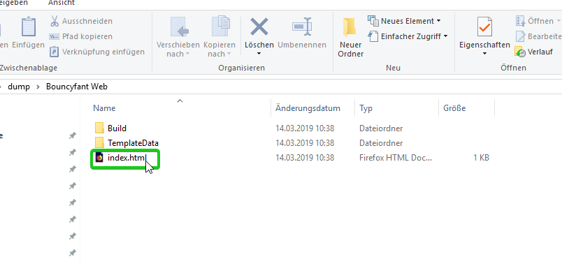

# Teil 10 - Das Spiel veröffentlichen!

Im Moment kann man das Spiel nur über Unity starten. Damit das Spiel auch eigenständig spielbar ist und veröffentlicht werden kann, muss man es noch exportieren.

!!! Abstract "Lernziele"
    In diesem Kapitel lernst du, wie du dein Unityprojekt exportieren kannst, sodass es auch ohne Unity spielbar ist.

----

In diesem Kapitel wirst du... |
----------------------------- |
Das Spiel für Windows exportieren |
Das Spiel für eine Webseite exportieren |


## Export für Windows

Klicke als erstes auf *File->Build & Run*


In den Build Settings kannst du nun einstellen für welche Plattform du exportieren möchtest. Wähle Windows x86.  
Wenn du das Spiel für Mac oder Linux exportieren willst, wähle das entsprechende Betriebssystem aus.

{: style="height:70%;width:70%"}

!!!Tip "Tipp"
	Wenn du für eine andere Plattform als Windows exportieren willst, kann es sein, dass du zusätzliche Softwarepakete installieren musst. Beispielsweise benötigt man für Android das *Android Software Development Kit* (Android SDK). Außerdem muss man sich für evtl. auch noch einmal um die Eingabe kümmern, da man auf mobilen Endgeräten im Normalfall keine Tastatur hat.

### Playersettings

In den Playersettings kannst du unter anderem festlegen, ob das Spiel standardmäßig im Vollbildmodus und mit welcher Auflösung es gestartet werden soll. (Vollbild solltest du deaktivieren, da es im Moment im Spiel selbst noch keine Möglichkeit gibt das Spiel zu beenden.) Außerdem kannst du auch den Namen und Companyname eingeben.

{: style="height:40%;width:40%"}

### Build

Wenn du alle Einstellungen vorgenommen hast, klicke in den *Buildsettings* auf *Build*, wähle einen geeigneten Ort, benenne die Datei *Bouncyfant.exe* und klicke auf *Speichern*.

Wenn der Buildvorgang zu Ende ist, findest du in dem von dir festgelegten Ordner die Datei *Bouncyfant.exe* sowie einen Ordner *Bouncyfant_Data*.


### Das Spiel starten und veröffentlichen

Nun kannst du das Spiel mit einem Doppelklick auf die Datei *Bouncyfant.exe* starten. Wenn du das Spiel veröffentlichen, oder einer Freundin/einem Freund geben möchtest, musst du einfach *Bouncyfant.exe* und *Bouncyfant_Data* weitergeben und es kann auf jedem aktuellen Windowscomputer gestartet werden.

----

## Export für das Web

Klicke als erstes auf *File->Build & Run*

Wähle in den Buildsettings unter *Platform* *WebGL* aus.

Falls bei dir "No WebGL module loaded" aufscheint, musst du erst noch das WebGL Modul für Unity herunterladen. Klicke dafür auf *Open Download Page* und installiere das Paket. 


!!!Bug "Achtung"
	Für die Installation benötigst du Administratorenrechte und	du musst Unity schließen.
	
Wenn WebGL installiert ist, klicke auf *Build* und wähle einen geeigneten Ordner, wo das Spiel gespeichert werden soll.


Das Spiel kannst du nun starten indem du die Datei *index.html* mit einem Webbrowser (z.B. Firefox) öffnest.



!!!Tip "Tipp"
	Auch wenn du dein Spiel eigentlich nicht auf einer Webseite im Internet laufen lassen möchtest, eignet sich der Export mit WebGL sehr gut, da es dann auf den meisten Betriebssystemen spielbar ist.

!!!Bug "Achtung"
	Wenn du das Spiel mit Google Chrome spielen möchtest kann es sein, dass es auf Anhieb nicht funktioniert. Chrome erlaubt es standardmäßig nämlich nicht Skripte von lokalen Dateien auszuführen. Um das Spiel dennoch lokal mit Chrome spielen zu können, kannst du Chrome mit dem Parameter ```--allow-file-access-from-files``` von der Konsole aus starten und in der Adressleiste dann den Dateipfad des Spiels eingeben.
	
	