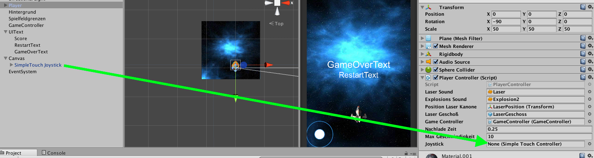

#Touchscreen Steuerung

!!! Abstract "Lernziele"

    In diesem Kapitel lernst du wie du Touchscreen-Eingaben in Unity verwenden kannst und das Raumschiff mit einem Touchscreen-Joystick steuerst.
-----

##Touchjoystick erstellen

Öffne den AssetManager in Unity (*Window->AssetManager*) und suche das gratis Paket *Simple Touch Controller*, lade es herunter und importiere es in dein Projekt.

!!!Tip "Hinweis"

    Nicht alle Assets im Assetstore sind gratis!


Du solltest nun einen Ordner *SimpleTouchController* in deinem Assetbereich haben.

Erzeuge einen neuen Canvas. (Rechte Maustaste in der Hierarchy *UI->Canvas*)

Gehe in den Assets nun zu *SimpleTouchController->Prefabs*. Dort findest du die Vorlage *SimpleTouch Joystick*. Ziehe diesen auf das vorhin erzeugte Canvas-Objekt.


Damit der Joystick etwas größer wird, stelle die Scalierung auf allen Achsen auf 2.

##Joysticksteuerung implementieren

Öffne das *PlayerController* Script.

In der *FixedUpdate()*-Methode befindet sich der Code für die Steuerung der Bewegung des Raumschiffs.

Die wichtigen Zeilen sind diese:
```csharp
      //Setze die Geschwindigkeit
      float geschwindigkeitHorizontal = Input.GetAxis("Horizontal") * maxGeschwindigkeit;
      float geschwindigkeitVertikal = Input.GetAxis("Vertical") * maxGeschwindigkeit;
      rb.velocity = new Vector3(geschwindigkeitHorizontal, 0.0f, geschwindigkeitVertikal);
```
Im Moment macht der Code folgendes: Er nimmt die Werte der in Unity eingestellten Eingabeachsen "Horizontal" und "Vertikal" und multipliziert diese mit *maxGeschwindigkeit* (Die Werte der Eingabeachsen sind immer zwischen -1 und 1). Wir wollen dies nun so ändern, dass anstatt der Eingabeachsen Input von dem Joystick verwendet werden.

Lege dafür oben im Script, bei den Deklarationen der Objektvariablen, eine neue *public* Variable vom Typ *SimpleTouchController* an und gib ihr einen sinnvollen Namen.

z.B.
```csharp
public SimpleTouchController joystick;
```

Die Klasse SimpleTouchController hat eine Methode *GetTouchPosition()* vom Typ Vector2. Diese gibt uns x und y Werte zwischen -1 und 1 abhängig davon, wo wir den Joystick hinziehen.
Verwende diese Methode nun statt *Input.GetAxis()* in FixedUpdate.

```csharp
//Setze die Geschwindigkeit
float geschwindigkeitHorizontal = joystick.GetTouchPosition.x * maxGeschwindigkeit;
float geschwindigkeitVertikal = joystick.GetTouchPosition.y * maxGeschwindigkeit;
rb.velocity = new Vector3(geschwindigkeitHorizontal, 0.0f, geschwindigkeitVertikal);
```

Nun musst du nur noch in Unity die Variable für den joystick im PlayerControllerScript zuvor erstellten Joystick-GameObject verknüpfen.



 
