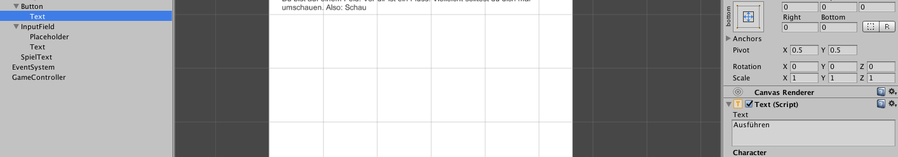

#Ellis' großes Abenteuer

!!! Abstract "Lernziele"
    In diesem Kapitel lernst du mit Hilfe von [Variablen](variables.md) und [Verzweigungen](conditionals.md) ein Text-basiertes [Adventure](https://de.wikipedia.org/wiki/Adventure) Spiel zu programmieren.

In diesem Spiel können Befehle in ein Textfeld geschrieben werden. Diese werden durch **Bedingungen**, wie etwa **Vergleiche von Variablen**, ausgewertet. **Wenn** eine Bedingung zutrifft, **dann** verändern sich Spielzustände.

----

##Ellis' großes Abenteuer - Ein Text-basiertes Adventurespiel

###Die Geschichte

Eine Maschine zerstört den Wald, in dem Elli lebt. Die Elefantin macht sich auf, um Ihren Wald zu retten. Dafür muss sie zuerst einen großen Fluss überqueren.

###Szenenaufbau

Erstelle ein neues 2D Unity-Projekt. Nenne es "Elli's großes Abenteuer".

Für das Adventure Spiel werden folgende Spielobjekte (GameObjects) für BenutzerInnen-Schnittstellen (User Interfaces) benötigt:

* *"Image"*
* *"Button"*
* *"InputField"*
* *"Text"*: Nenne dieses Spielobjekt "SpielText"

Hierbei ist die Anordnung der User Interface Elemente wichtig. Das Bild (*"Image"*) sollte im Hintergrund sein. Die Steuerelemente (*"InputField"*, *"Button"*, *"Spieltext"*) sollten im Vordergrund sein.

Das Spielfeld kann wie folgt angeordnet werden:

Darüber hinaus musst du mit Rechtsklick in das Hierarchie-Panel über "Create Empty" ein neues Spielobjekt erzeugen. Nenne es "GameController".

!!!success "Arbeitsauftrag"
    Ändere den Button-Text auf "Ausführen".
	

!!!success "Arbeitsauftrag"
    Ändere den Platzhalter-Text des Eingabefelds (*"InputField"*) auf "Text eingeben...".
	

!!!success "Arbeitsauftrag"
    Ändere den Text in "SpielText" auf "Du bist auf einem Feld. Vor dir ist ein Fluss. Vielleicht solltest du dich mal umschauen. Also: Schau".
	

Das *"Image"*-Spielobjekt ist eine Art Bilderrahmen. Du kannst im Inspektor ein Bild über *"Image (Script)"* > *"Source Image"* per [Drag and Drop](https://de.wikipedia.org/wiki/Drag_and_Drop#/media/File:Drag-and-drop-de.svg) zuweisen.

Für das erste Rätsel in diesem Adventure-Spiel (Wie kommt Elli über den Fluss?) brauchst du 3 Bilder: 

1. Das Startbild, auf dem Elli, ein Fluss und ein großer Stein erkennbar sind. 
2. Ein Bild, auf dem der Stein nicht sichtbar ist (weil Elli diesen trägt).
3. Ein Bild, auf dem der Stein im Wasser und Elli auf der anderen Seite des Flusses zu sehen ist.

Lade die drei Bilder auf deinen Computer herunter: [Elli's Abenteuer Start-Bilder](img/ellistartpictures.zip)

Lade die Bilder als "Assets" in dein Unity-Projekt. (Falls du das noch nicht gemacht hast, erstelle zuvor im Assets-Ordner 4 Unterordner: *"Sprites"*, *"Scripts"*, *"Vorlagen"* und *"Material"*. Die 3 Grafiken können im *"Sprites"*-Ordner abgelegt werden.)

Weise dem *"Image"*-Spielobjekt die Grafik *"ElliStart.png"* zu.

###Spiellogik

##Weiterführende Resourcen

