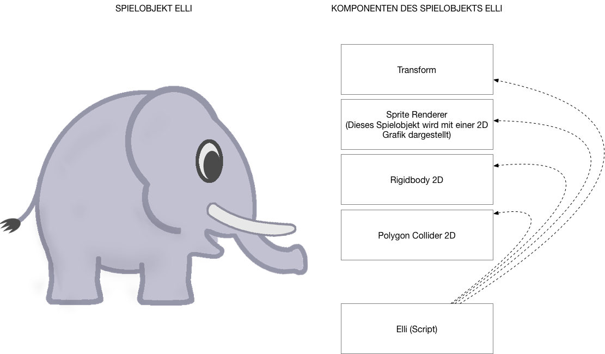

#Erste Schritte 

!!! Abstract "Lernziele"
    In diesem Kapitel lernst du, was ein Algorithmus ist. Du unterscheidest Spielobjekte und deren Komponenten in Unity. Du organisierst Projektdateien zu deinem Spiel. Und: Du schreibst dein erstes Programm in C*#*. 

---

##Was ist ein Algorithmus?

Informatikerinnen und Informatiker beschäftigen sich mit Algorithmen. Aber was ist das eigentlich - ein Algorithmus?

Programmieren könnte man als Problemlöseverfahren beschreiben. In unserem Fall ist das "Problem" etwa, dass wir ein Spiel erstellen wollen. Wir lösen es durch Einsatz von Unity und C*#*. Dabei kann man festhalten, dass nach einer bestimmten Zeit ein Resultat - also ein Spiel - entstehen sollte.

Ein bisschen allgemeiner könnte man daher sagen: 
**Ein Algorithmus ist ein Problemlöseverfahren in endlich vielen Schritten.**

!!! success "Übung"
	Schreibe *in Stichworten* einen Algorithmus für Zähne putzen.

---

##Erste Schritte in Unity

###Spielobjekte und Komponenten

In Unity besteht eine Szene aus einem oder mehreren Spielobjekt(en). Diese werden GameObject(s) genannt. Auch die Kamera, die eine Szene "filmt", ist ein GameObject. 

Spielobjekte können von unterschiedlicher Art (oder besser [Klasse](classes.md)) sein. Die Eigenschaften eines Spielobjekts werden durch Komponenten (Components) bestimmt. Jedes Spielobjekt hat etwa die Komponente [Transform](transform.md), mit Hilfe derer die Position, die Rotation und die Größe (oder Skalierung) des Spielobjekts bestimmt werden kann.
Auch physikalische Eigenschaften werden einem Spielobjekt durch eine Komponente verliehen. Bei 2D-Spielen heißt diese Rigidbody2D. Ebenso werden Grenzen eines Spielobjekts (für Kollisionsabfragen) durch eine Komponente - Collider - angegeben.

C*#*-Skripte werden einem Spielobjekt über *"Add Component"* > *"New Script"* > *"C*#*-Script"* "angeheftet". 

Das besondere an Skripten ist, dass du darin auf andere Komponenten des Spielobjekts oder überhaupt auf andere Spielobjekte in einer Szene zugreifen kannst. Weiters können Eingaben durch Keyboard, Maus oder GamePad verwendet  oder andere Aspekte der Unity [Spiel-Engine](https://de.wikipedia.org/wiki/Spiel-Engine) verändert werden. Somit kannst du gezielt die Spiellogik für dein Spiel programmieren. 

---

###Projektdateien

Projektdateien findest du in Unity unter *"Project"* > *"Assets"*. Mit *"Create"* kannst du dort neue Ordner und Dateien anlegen. Natürlich kannst du in Unity auch mit [Drag and Drop](https://de.wikipedia.org/wiki/Drag_and_Drop#/media/File:Drag-and-drop-de.svg) Dateien importieren.

Um sich Übersicht über die verwendeten Dateien zu verschaffen, können Ordner angelegt werden. 

!!!success "Arbeitsauftrag" 
    Lege folgende Ordner im "Assets"-Bereich von Unity an:

    * *Sprites*: für alle 2D Grafiken
    * *Scripts*: für alle C*#* Programm-Skripte
    * *Vorlagen*: für Spielobjekte, die als Vorlage erstellt und verwendet werden
    * *Material*: für physikalische Materialeigenschaften

??? tip "Tipp"
    Du gelangst per Rechtsklick auf den *"Assets"*-Ordner zu einem Menü, in dem du ebenso *"Create"* findest.

!!!success "Arbeitsauftrag"
    Lege die Datei [elef.png](img/elef.png) im Ordner *"Sprites"* ab.

##Erste Schritte in C*#*

###Hallo Elli!

###Programmstruktur in C*#*

##Weiterführende Resourcen