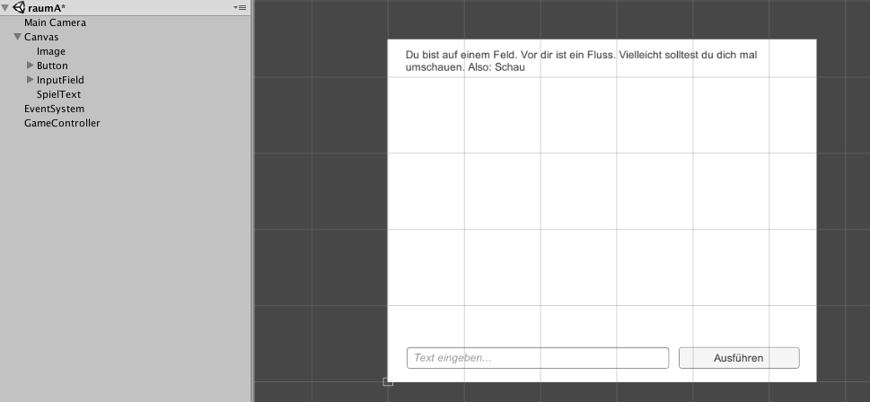

#Ellis' großes Abenteuer

!!! Abstract "Lernziele"
    In diesem Kapitel lernst du mit Hilfe von [Variablen](T04-variables.md) und [Verzweigungen](T08-conditionals.md) ein Text-basiertes [Adventure](https://de.wikipedia.org/wiki/Adventure) Spiel zu programmieren.

In diesem Spiel können Befehle in ein Textfeld geschrieben werden. Diese werden durch **Bedingungen**, wie etwa **Vergleiche von Variablen**, ausgewertet. **Wenn** eine Bedingung zutrifft, **dann** verändern sich Spielzustände.

----

##Ellis' großes Abenteuer - Ein Text-basiertes Adventurespiel

###Die Geschichte

Eine Maschine zerstört den Wald, in dem Elli lebt. Die Elefantin macht sich auf, um Ihren Wald zu retten. Dafür muss sie zuerst einen großen Fluss überqueren.

---

###Szenenaufbau

Erstelle ein neues 2D Unity-Projekt. Nenne es "Elli's großes Abenteuer".

Für das Adventure Spiel werden folgende Spielobjekte (GameObjects) für BenutzerInnen-Schnittstellen (User Interfaces) benötigt:

* *"Image"*
* *"Button"*
* *"InputField"*
* *"Text"*: Nenne dieses Spielobjekt "SpielText"

Hierbei ist die Anordnung der User Interface Elemente wichtig. Das Bild (*"Image"*) sollte im Hintergrund sein. Die Steuerelemente (*"InputField"*, *"Button"*, *"Spieltext"*) sollten im Vordergrund sein.

Das Spielfeld kann wie folgt angeordnet werden:


Darüber hinaus musst du mit Rechtsklick in das Hierarchie-Panel über "Create Empty" ein neues Spielobjekt erzeugen. Nenne es "GameController".

!!!success "Arbeitsauftrag"
    Ändere den Button-Text auf "Ausführen".


!!!success "Arbeitsauftrag"
    Ändere den Platzhalter-Text des Eingabefelds (*"InputField"*) auf "Text eingeben...".


!!!success "Arbeitsauftrag"
    Ändere den Text in "SpielText" auf "Du bist auf einem Feld. Vor dir ist ein Fluss. Vielleicht solltest du dich mal umschauen. Also: Schau".


Das *"Image"*-Spielobjekt ist eine Art Bilderrahmen. Du kannst im Inspektor ein Bild über *"Image (Script)"* > *"Source Image"* per [Drag and Drop](https://de.wikipedia.org/wiki/Drag_and_Drop#/media/File:Drag-and-drop-de.svg) zuweisen.


Für das erste Rätsel in diesem Adventure-Spiel (Wie kommt Elli über den Fluss?) brauchst du 3 Bilder:

1. Das Startbild, auf dem Elli, ein Fluss und ein großer Stein erkennbar sind.
2. Ein Bild, auf dem der Stein nicht sichtbar ist (weil Elli diesen trägt).
3. Ein Bild, auf dem der Stein im Wasser und Elli auf der anderen Seite des Flusses zu sehen ist.

Lade die drei Bilder auf deinen Computer herunter: [Elli's Abenteuer Start-Bilder](img/ellistartpictures.zip)

Lade die Bilder als "Assets" in dein Unity-Projekt. (Falls du das noch nicht gemacht hast, erstelle zuvor im Assets-Ordner 4 Unterordner: *"Sprites"*, *"Scripts"*, *"Vorlagen"* und *"Material"*. Die 3 Grafiken können im *"Sprites"*-Ordner abgelegt werden.)

!!!success "Arbeitsauftrag"
    Weise dem *"Image"*-Spielobjekt die Grafik *"ellistart.png"* zu.


---

###Spiellogik

Füge dem *"GameController"* Spielobjekt ein Skript hinzu. Nenne das Skript ebenfalls "GameController".

Überschreibe den Quellcode in der Datei "GameController.cs" mit:
``` c#
using UnityEngine;
using UnityEngine.UI;
public class GameController : MonoBehaviour
{
	public InputField Eingabefeld;
	public Text TextBox;
	public Image bilderrahmen;
	public Sprite startSpielzustand;
	public Sprite spielzustand2;
	public Sprite spielzustand3;

	haeltSteinMitRuessel = //Ergänze hier den *Datentyp* und den *Wert*!

	public void ausfuehren()
	{
		if (Eingabefeld.text == "Hebe Stein")
		{
			TextBox.text = "Du hast den Stein aufgehoben. Sieht aus, als könnte man diesen in den Fluss werfen.";
			bilderrahmen.sprite = spielzustand??; //Ergänze die passende Grafik!
			//Ändere den Wert der Variable "haeltSteinMitRuessel"!
		}

		if ( == "Überquere Fluss")  //Ergänze hier!
		{
			if () { //Ergänze die Bedingung, die erfüllt sein muss!
				TextBox.text = "Du hast den Stein ins Wasser geworfen. Du hast den Fluss überquert.";
				bilderrahmen.sprite = spielzustand??; //Ergänze die passende Grafik!
			}
			// Ergänze hier das "Sonst" der if-Abfrage!
			{
				 = "Oh nein, der Fluss ist zu reißend. Du musst etwas in den Fluss werfen. Gibt es hier etwas, das man aufheben kann?";
				 //Ergänze hier!
			}
		}

		if (Eingabefeld.text == "Schau")
		{
			TextBox.text = "Vor dir ist ein reißender Fluss, den du überqueren musst. Da liegt auch ein Stein, vielleicht kann man den heben?";
		}
	}
}
```

Damit du das Skript im Spiel verwenden kannst, musst du zwei Arbeitsschritte machen:

1. Verknüpfe den Aufruf der Funktion "ausfuehren" mit "On Click" des Buttons "Ausführen". (Eine Erklärung, wie das geht, findest du beim [Krapfenklicker](T06-donutclicker.md) Spiel!)

2. Verknüpfe die *public* Variablen im Skript mit GameObjects und Grafiken in Unity. Wähle dazu den GameController im Hierarchy Panel aus und ziehe die entsprechenden GameObjects auf die Felder im Inspector!


!!!success "Arbeitsauftrag"
    Vervollständige das GameController-Skript und teste dein Spiel!

---


##Weiterführende Resourcen

* [Textadventures Wikipedia-Eintrag (englisch)](https://en.wikipedia.org/wiki/Adventure_game)
* [Grumpy Gamer Weblog (englisch)](https://www.grumpygamer.com) (Der Blog von [Ron Gilbert](https://de.wikipedia.org/wiki/Ron_Gilbert))
