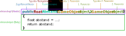

#Funktionen

!!! Abstract "Lernziele"

    In diesem Kapitel lernst du was Funktionen beim Programmieren sind. Du lernst, wofür Funktionen verwendet werden, was **Parameter** und **Rückgabewerte** sind und wie du deine eigenen Funktionen schreiben kannst.
-----

##Wofür braucht man Funktionen?

Funktionen sind kleine *Unterprogramme*.


Vielleicht musst du für dein Spiel den Abstand zwischen zwei Objekten berechnen? Diese Berechnung benötigt man in den meisten Spielen sehr häufig.

Eine Möglichkeit ist: den dafür nötigen Code jedes Mal eintippen,  
oder: mit Kopieren und Einfügen überall einzufügen, wo du ihn benötigst.  
Beides ist aber nicht nur sehr viel Arbeit, sondern auch sehr schwer zu warten. Wenn du zum Beispiel später merkst, dass deine Berechnung einen Fehler enthält, musst du an allen Stellen im Programm den Fehler ausbessern.

Eine bessere Möglichkeit ist:

Du erstellst eine **Funktion**, die den Abstand zwischen zwei Punkten berechnet.  
Die Erstellung einer Funktion nennt man *Definition*.

```csharp
   //Diese Funktion berechnet den Abstand zwischen zwei Objekten
   public float Abstand(GameObject object1, GameObject object2)
    {
        float abstand = Vector3.Distance(object1.transform.position, object2.transform.position);

        return abstand;
    }
```

Anstatt nun jedes Mal diese Berechnung *händisch* durchzuführen, kannst du diese Funktion verwenden.  
Das Ausführen einer Funktion bezeichnet man als *Aufruf*.

```csharp
  float entfernung = Abstand(elli, ossi);
```

Außerdem musst du Änderungen nur an einer Stelle, nämlich im Code der Funktion, durchführen.

##Aufbau einer Funktion



Der [Zugriffsmodifikator](T12-accessmodifiers.md) legt fest, von welchen Klassen man auf die Funktion zugreifen kann.

Eine Funktion kann beliebig viele **Parameter** haben. **Parameter** legen genauer fest, was die Funktion tun soll. In unserem Beispiel wird über die **Parameter** festgelegt, von welchen zwei Spielobjekten der Abstand berechnet werden soll.  
Die **Parameter** stehen im Body der Funktion als [Variablen](T04-variables.md) zur Verfügung.

##Funktionen mit Rückgabewert

Das Schlüsselwort ```return``` beendet die Ausführung einer Funktion und gibt den danachstehenden Wert an den Funktionsaufrufer zurück.

Zum Beispiel kannst du das Ergebnis eines Aufrufs der Funktion ```Abstand()``` in einer [Variable](T04-variables.md) speichern oder direkt in einem *if*-Statement verwenden:

```csharp
	if(Abstand(elli, pilz) < 100){

	}
```


##Funktionen ohne Rückgabewert

Nicht immer benötigt man eine Funktion mit Rückgabewert.  
Für so ein Funktion gibt man als Rückgabetyp ```void``` an, außerdem benötigt man das Schlüsselwort ```return``` nicht.

zwei Beispielel:
```csharp
	 //  Diese Funktion erhöht den Punktestand und aktualisiert den Text des Punktestands.
    public void ErhoehePunktestand(int punkte)
    {
        punkteStand = punkteStand + punkte;
        AktualisierePunktestandText();
    }

	//  Diese Funktion aktualisiert den angezeigten Text des Punktestands.
    //  Sie muss immer aufgerufen werden, nachdem sich die Punkte geändert haben.
    private void AktualisierePunktestandText()
    {
        scoreText.text = "Score: " + punkteStand;
    }

```


!!!bug "ACHTUNG"
    Je nach Programmiersprache gibt es unterschiedliche Definitionen der Begriffe *Funktion*, *Prozedur* und *Methode*. Generell (C,C++, C# und Java) ist eine Funktion der allgemeine Begriff für alle Funktionsarten.
    Funktionen ohne Rückgabewert werden als *Prozeduren* bezeichnet und Funktionen innerhalb von Klassen sind *Methoden*. Methoden beschreiben Verhalten von [Objekten/Klassen](T15-classes.md) z.B. esseFisch() kann eine Methode der Klasse Katze sein.

-----

##Weiterführende Resourcen

* [Variables and Functions Tutorial (englisch)](https://unity3d.com/learn/tutorials/topics/scripting/variables-and-functions)

* [Scope and Access Control in Unity Tutorial  (englisch)](https://unity3d.com/learn/tutorials/topics/scripting/scope-and-access-modifiers)
