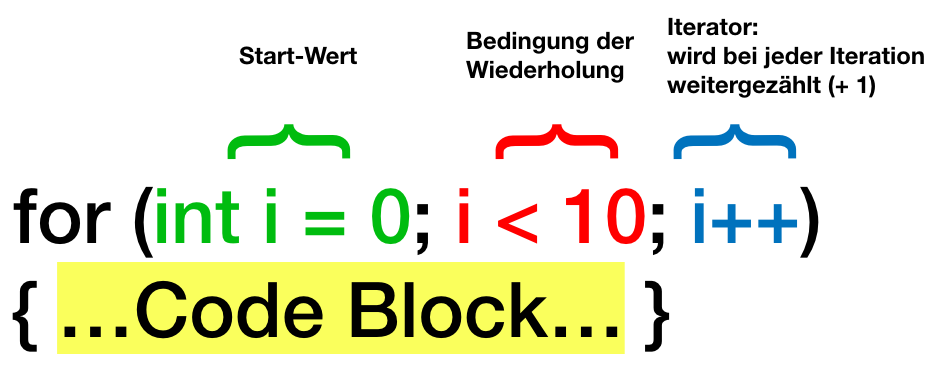

#Schleifen

!!!abstract "Lernziele"
    Hier lernst du, wie du mit Schleifen Programmcode wiederholen kannst.


Wo **Programmcode wiederholt** wird, können Schleifen verwendet werden. Spiele werden meist in einer [Spielschleife](T14-gameloop.md) gestartet.

!!!tip "Tipp"
    **Iteration** bedeutet **ein** *Schleifendurchlauf*.

----

##for-Schleife



Ein Beispiel:
``` c#
    for (int i = 0; i < 10; i++)
	{
        Debug.Log("Ich mag Kiwis.");
	}
```

!!!success "Arbeitsauftrag"
    Öffne dein Unity-Startprojekt. Öffne das Elefanten-Skript. Ergänze die Funktion "OnDisable()" mit der oben angezeigten for-Schleife und teste das Skript. Was wird auf der Konsole in Unity ausgegeben?

----

##while-Schleife


while-Schleifen laufen, bis eine Abbruchbedingung **wahr** ist.

----

##Schlüsselwörter "break" (Abbrechen) und "continue" (Weitermachen)

Durch das Schlüsselwort **break** wird eine Schleife verlassen.

Durch das Schlüsselwort **continue** wird zum nächsten Schleifendurchlauf gesprungen.

!!!success "Übung"
    Wie oft wird bei nachfolgendem Quellcode auf der Konsole "Ich mag Käse!" ausgegeben?

``` c#
    while (x < 10)
	{
        Debug.Log("Ich mag Käse!");
		break;
	}
```

----


##Weiterführende Resourcen

* [Schleifen in C# für die Spieleprogrammierung (englisch)](http://gamecodeschool.com/c-sharp/loops-in-c/)
