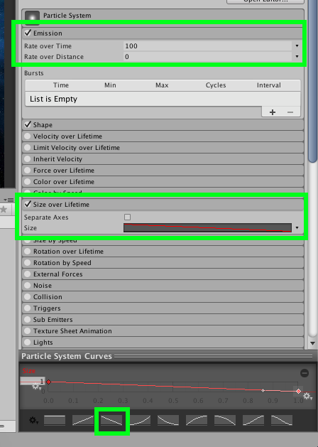
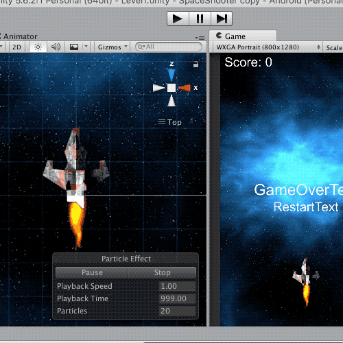

#Partikelsysteme erstellen

!!! Abstract "Lernziele"

    In diesem Kapitel lernst du was Partikelsysteme (particles) sind und wofür sie verwendet werden. Außerdem wirst du für das Spiel *Space-Asteroids* einen Partikeleffekt für den Raketenantrieb des Raumschiffs erstellen.
-----

Partikelsysteme werden in Computerspielen für zum Beispiel folgende Dinge verwendet:

* Flüssigkeiten (Wasserfälle, Flüssigkeitsspritzer)
* Explosionen
* Feuer
* Rauch, Dampf, Nebel
* Feuerwerk

{: style="height:40%;width:40%"}
{: style="height:40%;width:40%"}
{: style="height:40%;width:40%"}
{: style="height:40%;width:40%"}

##Funktionsweise

Die Funktionsweise ist dabei ganz einfach. Ein Partikelsystem besteht aus Partikeln und einem sogenannten Emitter.

###Partikel
Partikel sind kleine Sprites oder 3D Objekte.  
In der oben zu sehenden Explosion ist zum Beispiel jeder einzelne Funke ein Partikel. Außerdem besteht der Rauch auch aus ganz vielen kleinen grauen Sprites.

###Emitter
Die Aufgabe des Emitters (to emit = ausstoßen) ist es, ganz viele Partikel nach einem bestimmten Schema auszustoßen um damit den Effekt zu erzielen.
Im oben zu sehenden Feuer stößt der Emitter ganz viele kleine orange Partikel für das Feuer aus. Wenn diese sich überlappen, werden sie heller. Damit wird der Flammeneffekt erzeugt.

!!!Tip "Hinweis"
	In Unity gibt es für den Emitter keine eigene Komponente, er ist Teil der Komponente *Particle System*

##Erstellung eines Partikelsystems in Unity

Nun wirst du dein eigenes Partikelsystem für den Raketenantrieb des Raumschiffs im Spiel *Space-Asteroids* erstellen.

Falls du das Tutorial [Programmierung der Asteroiden](T01-spaceasteroids.md) schon absolviert hast, verwende nun dieses Unityprojekt, ansonsten kannst du dir [hier](https://github.com/learn2proGrAME/proGrAME-Beispiele-und-Quellcodes/blob/master/SpaceAsteroids/SpaceAsteroids2.zip) das Projekt herunterladen.

###1. Erstelle ein neues Partikelsystem.
Klicke dafür In der Hierarchy mit der rechten Maustaste auf das Objekt *Player* und anschließend *Particle System*

Damit erstellst du ein Partikelsystem als Unterobjekt von *Player*. Wenn sich nun das Raumschiff bewegt, bewegt sich das Partikelsystem automatisch mit.

Nun siehst du in der Sceneview dein neues Partikelsystem und es stößt bereits weiße Partikel aus.

Stelle nun die Rotation auf x=270, y=0, y0 damit die Partikel aus dem Triebwerk hinaus nach hinten fliegen.

###2. Material erstellen
Erstelle als nächstes im Assetbereich im Ordner *Materials* ein neues Material und benenne dieses Material *Raketenantrieb*.

Wähle nun im Inspector bei *Shader* die Option *Particles->Additive*. Dies bedeutet, dass die Helligkeitswerte addiert werden, falls mehrere Partikel übereinander liegen. Dadurch werden die Flammen in der Mitte, wo sich viele Partikel überlappen, heller.

Klicke dann bei *Particle Texture* auf select und wähle *Default-Particle*.

###3. Partikelsystemeinstellungen
Klicke in der Hierarchy wieder auf das Partikelsystem.

Nimm nun im Inspector folgende Einstellungen vor:

1. Klicke auf *Shape* und stelle Shape von *Cone* auf *Box* um und stelle anschließend in der Transform die Skalierung auf x=0.2, y=0.5, z=0.5 um die Größe der Box aus denen die Partikel austreten an die Triebwerke des Raumschiffs anzupassen.
2. Stelle nun
    * *Start Lifetime* auf 0.2
    * *Start Speed* auf 20
    * *Start Size* auf 5
    * *Start Color* auf Orange

  
3. Um nun die Anzahl der Partikel zu erhöhen, klicke auf *Emission* und gib bei *Rate over Time* 100 ein.  
4. Stelle nun noch ein, dass die Partikel Anfangs groß sind und dann immer kleiner werden, indem du einen Haken bei *Size over Lifetime* setzt und dann die Kurve auswählst, die von links oben nach rechts unten geht.  
  
5. Zum Schluss wähle ganz unten im Punkt *Renderer* das zuvor erstellte Material aus.

**Fertig ist der Raketenantriebs-effekt!**

---

##Weiterführende Resourcen
[https://unity3d.com/de/learn/tutorials/topics/graphics/particle-system](https://unity3d.com/de/learn/tutorials/topics/graphics/particle-system)
